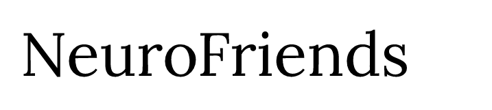

### [Video Demo](https://youtu.be/5Mp0ZaFU1gs)

# Overview
NeuroFriends is a social networking site for neurodiverse individuals to connect and communicate with each other. The goal is to provide a safe and supportive space for individuals who are on the autism spectrum, have ADHD, or other neurological differences.

# Technologies

- Flask (Python web framework)
- Jinja2 (template engine)
- SQLite (relational database management system)
- Werkzeug (utility library for WSGI applications)
- Javascript
- HTML
- CSS
- Bootstrap 5

# Installation

- Clone / fork this repository.
